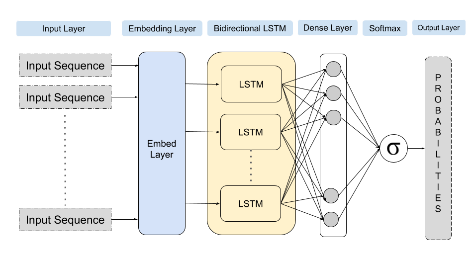

<h1> Emoji Prediction from Twitter Data 
using Deep Learning Approach
</h1>

[![IEEE](https://img.shields.io/badge/IEEE-ASIANCON-00629B.svg?logo=data:image/svg+xml;base64,PD94bWwgdmVyc2lvbj0iMS4wIiBzdGFuZGFsb25lPSJubyI/Pgo8IURPQ1RZUEUgc3ZnIFBVQkxJQyAiLS8vVzNDLy9EVEQgU1ZHIDIwMDEwOTA0Ly9FTiIKICJodHRwOi8vd3d3LnczLm9yZy9UUi8yMDAxL1JFQy1TVkctMjAwMTA5MDQvRFREL3N2ZzEwLmR0ZCI+CjxzdmcgdmVyc2lvbj0iMS4wIiB4bWxucz0iaHR0cDovL3d3dy53My5vcmcvMjAwMC9zdmciCiB3aWR0aD0iNDAxLjAwMDAwMHB0IiBoZWlnaHQ9IjM4My4wMDAwMDBwdCIgdmlld0JveD0iMCAwIDQwMS4wMDAwMDAgMzgzLjAwMDAwMCIKIHByZXNlcnZlQXNwZWN0UmF0aW89InhNaWRZTWlkIG1lZXQiPgo8bWV0YWRhdGE+CkNyZWF0ZWQgYnkgcG90cmFjZSAxLjE2LCB3cml0dGVuIGJ5IFBldGVyIFNlbGluZ2VyIDIwMDEtMjAxOQo8L21ldGFkYXRhPgo8ZyB0cmFuc2Zvcm09InRyYW5zbGF0ZSgwLjAwMDAwMCwzODMuMDAwMDAwKSBzY2FsZSgwLjEwMDAwMCwtMC4xMDAwMDApIgpmaWxsPSIjZmZmZmZmIiBzdHJva2U9Im5vbmUiPgo8cGF0aCBkPSJNMTgyOSAzNzY1IGMtMTQgLTggLTc3IC04MSAtMTM5IC0xNjIgLTQ3NyAtNjIyIC05MzYgLTEwNzcgLTE0OTQKLTE0ODIgLTg2IC02MiAtMTY1IC0xMjQgLTE3NiAtMTM4IC0yNSAtMzIgLTI2IC05OCAtMiAtMTM1IDEwIC0xNSA1OSAtNTYgMTA5Ci05MiA2MTcgLTQzNiAxMjQ4IC0xMDYzIDE2MDEgLTE1OTAgNDggLTcyIDc1IC0xMDIgOTkgLTExMiA0MyAtMTggOTMgLTE4IDEyMQoxIDEyIDkgNzMgODQgMTM2IDE2OCAzNjYgNDg5IDc5NiA5MzEgMTI3MSAxMzA5IDEyOCAxMDEgMjg3IDIxNyAzNTUgMjU4IDUxCjMxIDczIDYzIDczIDExMSAwIDU0IC0zMSA5OSAtOTkgMTQzIC05NyA2NCAtMzIxIDIzMyAtNDQ5IDMzOSAtMTk5IDE2NCAtMzg5CjM0NCAtNTk3IDU2NCAtMjU2IDI3MSAtNDI3IDQ3NSAtNTg1IDY5OSAtNzUgMTA1IC0xMTIgMTM0IC0xNzAgMTM0IC0xNSAtMQotNDAgLTcgLTU0IC0xNXogbTE0NSAtNDk0IGM2MSAtMjEgMTAzIC00OSAyMjcgLTE0NyAzNTUgLTI4MyA2NzMgLTYxMCA5NDUKLTk3MSAxMDUgLTE0MCAxMzQgLTE5MyAxMzQgLTI0OCAwIC0xMTcgLTIwMCAtMzc2IC01ODkgLTc2NiAtMzk1IC0zOTQgLTY4NwotNjE5IC04MDQgLTYxOSAtNDggMCAtMjE0IDEwNiAtMzY2IDIzMyAtMTUxIDEyNiAtNDA0IDM2MiAtNTQ2IDUwOCAtMjMwIDIzNgotNDQ2IDUxMSAtNDczIDYwMiAtMTIgNDIgLTEyIDUzIDMgOTYgNDQgMTMyIDM2NCA1MDcgNzEwIDgzMCAyMTYgMjAyIDI3OSAyNTYKNDUwIDM4NCAxNjUgMTI0IDIwMiAxMzYgMzA5IDk4eiIvPgo8cGF0aCBkPSJNMTgzMiAzMTk2IGMtNDQgLTIwIC0yMjkgLTE1OSAtMzgyIC0yODYgLTI5MSAtMjQyIC04MDEgLTc5NCAtODU3Ci05MjcgLTIwIC01MCAtMTYgLTExNCAxMSAtMTY2IDYwIC0xMTIgMzMyIC00MjMgNTg3IC02NzIgMjEzIC0yMDggNTMyIC00NzUKNjIzIC01MjIgNDIgLTIyIDEyNCAtMTkgMTcyIDUgNTMgMjcgMjM1IDE2NCAzNTkgMjcxIDE0MSAxMjAgNTI1IDUwNyA2MjAgNjI1CjEyMSAxNDkgMTk1IDI0NyAyMTYgMjg4IDI0IDQ3IDI0IDEyMSAwIDE3MyAtNDUgOTggLTI3MiAzNzUgLTQ4NiA1OTMgLTIyOAoyMzMgLTU2MiA1MjMgLTY5MCA1OTcgLTU0IDMyIC0xMjggNDEgLTE3MyAyMXogbTE2MiAtNTgxIGM1MSAtMTQzIDk3IC0yNjgKMTAxIC0yNzcgNiAtMTYgMCAtMTggLTcwIC0xOCBsLTc4IDAgNyAtMTcyIGMzIC05NSA5IC0yMjYgMTMgLTI5MCBsNiAtMTE4Ci04OCAwIC04OCAwIDcgMTg4IGMzIDEwMyA5IDIzMyAxMyAyOTAgbDYgMTAyIC03MCAwIC03MCAwIDkyIDI2NCBjNTEgMTQ1IDk2CjI3OCAxMDAgMjk3IDkgNDEgLTIgNjggMTE5IC0yNjZ6IG0tNDE5IC00OTAgbDYwIC0zOCAtODUgLTI3IGMtMTAyIC0zMiAtMTYzCi03MCAtMTk0IC0xMjIgLTU4IC05NyAzMCAtMTcwIDI2NCAtMjE4IDMyMCAtNjcgNzU5IC01IDg2NiAxMjMgNTIgNjIgMjEgMTM4Ci03OCAxODYgLTYxIDMwIC02NCAzMSAtMTE1IDE4IGwtNTIgLTE0IC0yMiA2MSBjLTEyIDM0IC0yNCA2NiAtMjYgNzIgLTIgNyA1OAotNCAxNDYgLTI1IDgzIC0yMCAxNTEgLTM5IDE1MSAtNDMgMCAtNSAtNiAtOCAtMTQgLTggLTMyIDAgLTI1IC0yMCAxNCAtNDAgNTkKLTMwIDExOCAtOTMgMTI1IC0xMzMgMjggLTE0NiAtMjUyIC0yNjggLTY3MCAtMjkzIC0yNDQgLTE0IC01ODcgNTAgLTc0MiAxMzgKLTUxIDI5IC0xMDkgODUgLTEyMyAxMTggLTE4IDQ0IDMgMTA0IDU1IDE1NSA1MSA0OSAxOTggMTI5IDI3NiAxNDkgNDkgMTIgNTYKMTIgNzkgLTQgMTQgLTkgNTIgLTM0IDg1IC01NXogbTQwOCAtNjM3IGM0IC01MSA5IC0xNzIgMTIgLTI2OCA0IC05NiA4IC0xODUKMTEgLTE5NyA0IC0yMyA0IC0yMyAtMTIwIC0yMyBsLTEyNSAwIDUgMzMgYzQgMjkgMjQgNDY4IDI0IDUyNCAwIDIyIDIgMjMgOTQKMjMgbDkzIDAgNiAtOTJ6Ii8+CjxwYXRoIGQ9Ik0yNDY0IDQzNiBjLTQ5IC0yMiAtNzQgLTYxIC03NCAtMTE4IDAgLTkzIDQ2IC0xMzggMTQwIC0xMzggNDMgMCA1NQo1IDg2IDMzIDI4IDI2IDM3IDQyIDQxIDc4IDYgNTUgLTE1IDExMSAtNTEgMTM0IC0zNSAyMyAtMTA0IDI5IC0xNDIgMTF6Ii8+CjwvZz4KPC9zdmc+Cg==)](https://doi.org/10.1109/ASIANCON51346.2021.9544680)<!--
GAP
-->

<!-- 

-->

## 📌Introduction

<h4 align="justify" ><i>Emojis are a small visual representation of emotions or objects that are usually used in text messages to enhance the communication experience between individuals.</i> This project aims to understand the underlying semantics of the text sentence using natural processing techniques to predict reasonable emojis based on the context. With the rise in the widespread use of social media platforms like Twitter and instant messaging, many users are using these emojis in their text messages to convey broad feelings efficiently, which sometimes cannot be expressed using just words. Thus, giving rise to a problem statement that is to identify the relationship between these text messages and the emojis used in them. This project aims to understand the underlying semantics of the text sentence using natural processing techniques to predict reasonable emojis based on the context.
</h4>

 

## 🗃️Dataset

The twitter emoji dataset obtained from CodaLab comprises of 50 thousand tweets along with the associated emoji label. Each tweet in the dataset has a corresponding numerical label which maps to a specific emoji. The emojis are of the 20 most frequent emojis and hence the labels range from 0 to 19. Initial dataset in raw text format is later written to a csv file using python scripts.

Get the data [here](https://github.com/fvancesco/Semeval2018-Task2-Emoji-Detection)!

 

## Deep Learning Model Architecture

 

The proposed architecture consists of Embedding layer followed by the Bidirectional LSTMs layer, then a layer of dense hidden layer which passes of its activations to a SoftMax activation function which outputs the final prediction scores. First the sequences that were created from the text data are passed batch wise to the neural network. These sequences are passed to an Embedding layer, here for each number in the sequence, vector of constant length is computed which will be adjusted while training. These embedding vectors are created to create similarity among related word. Meaning that words which are highly related, after computation will have vectors with high similarity. After the embedding layer, the vectors computed are passed to a layer of Bidirectional LSTMs which have the capability to store information in their memory. These cells encapsulate contextual information while training in their long-term and short-term memory, which are updated continuously while training. The output from the LSTMs layer is then passed to a dense layer, which basically contain neurons with Rectified Linear activation function (ReLU). The activation scores from these cells is then passed to another layer of neuron. Here the activation of these neurons will be Softmax function. Softmax function takes the activation of all the previous neurons and outputs a distribution of probabilities whose sum equals to one. A probability for each class will be predicted as the final output of the model. The class with highest probability among them can be chosen as the predicted class.

 

## Conclusion

In this paper, the results discussed above we can conclude that Support Vector Classifier model performed marginally better suggesting that this improvement in performance could be attributed to the fact that the SVM algorithm might have been able to draw out some relationships in the data than that of the probabilistic Naive Bayes model. These kinds of results obtained from machine learning models is due to the fact that the available data that is being used for training the model is not generalizable enough. Also, another drawback is that, some emojis overweight the count of other making the model to bias itself into predicting that emoji more often. Furthermore, from the confusion matrix, it is pretty clear that, the model is biased towards weights rather than the context of text which shows that the model has a low understanding of the semantic relationship between the sentence and the emoji. Thus, we have proposed and implemented a Deep Learning approach using Bidirectional LSTMs for predicting emojis based on the input text tweet. This approach yielded the optimal results than all the base machine models.

 

## 📚References
[1] Barbieri Francesco et al., "Semeva12018 task 2: Multilingual emoji prediction", Proceedings of The 12th International Workshop on Semantic Evaluation, 2018.

[2] Barbieri Francesco, Luis Espinosa-Anke and Horacio Saggion, "Re-vealing patterns of Twitter emoji usage in Barcelona and Madrid", Frontiers in Artificial Intelligence and Applications. 2016; (Artificial Intelligence Research and Development), vol. 288, pp. 239-44, 2016.

[3] Barbieri, Francesco & Ballesteros, Miguel & Saggion, Horacio. (2017). Are Emojis Predictable?. 105-111. 10.18653/v1/E17-2017. 

 

### 📝License
Copyright © 2021 Hemanth Kollipara, Pavithra Kollipara

